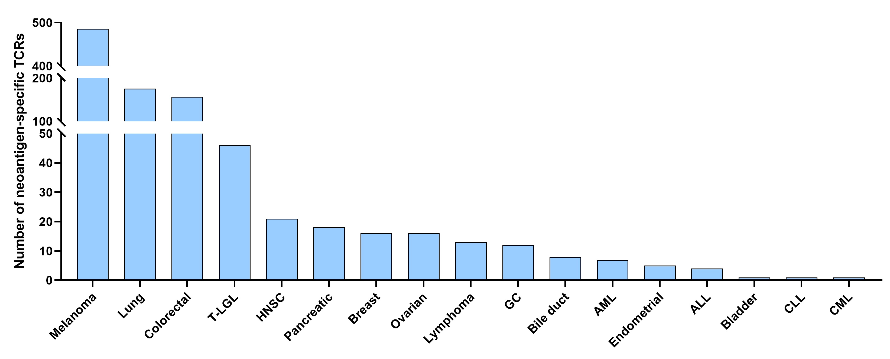
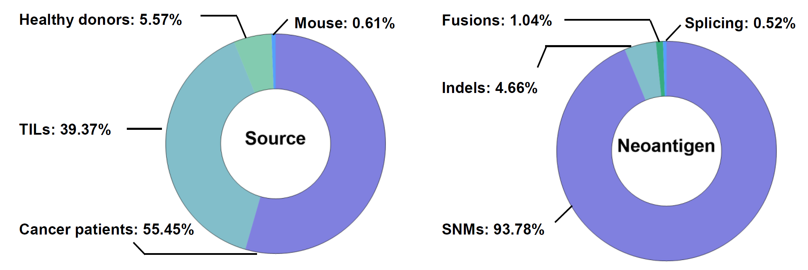

# NeoTCR
### Introduction

**NeoTCR** is an immunoinformatic database of T-cell receptor (TCR) sequences with neoantigen specificities. The primary goal of NeoTCR is to facilitate access to existing information on neoantigen-specific TCRs, such as the neoepitope that it recognizes and binds, the relating somatic mutation, the HLA contexts, and so on. NeoTCR allows for fuzzy or accurate database searching based on different criteria. Besides, NeoTCR also provides useful web-based tools for comprehensive analysis of TCR sequencing data that users upload. These tools could help users to: (I) annotate the TCR sequences, including the V/(D)/J gene segment, CDR3 sequence, TCR repertoire clonality, and so on. (II) visualize the feature of TCR repertoires, including V/(D)/J gene segment counts and usage, CDR3 length and clonotype distribution, and so on. (III) blast CDR3 sequences with NeoTCR to label the known neoantigen-specific TCRs, and with other databases (e.g. VDJdb and McPAS-TCR) to find out the bystander viral-specific. NeoTCR will serve as a valuable platform to study the role of neoantigen-associated T-cells in anti-tumor immunity and further improve the understanding of biological functions and applications of neoantigen-specific TCRs.





### Implementation

The NeoTCR database was based on the web and B/S architecture, and implemented using Spring Boot and VUE. All TCR sequences related to neoantigens were stored in MySQL. The user interface was developed using Element UI and the data visualization was developed using ECharts which provide intuitive figures to describe the follow-up analysis result.

### Install
Requirements:
 - Java = 1.8  
 - Python = 3.8  
 - Vue = 2.5.2  
 - Mixcr = 3.0.13  
 - Tomcat = 9.0.63  
 - Springboot = 2.3.1    

#### 1. neotcr-vue

   > A Vue.js project  

   **Build Setup**

   ``` bash
   # install dependencies
   
   npm install
   
   
   # serve with hot reload at localhost:8080
   
   npm run dev
   
   
   # build for production with minification
   
   npm run build
   
   
   # build for production and view the bundle analyzer report
   
   npm run build --report
   ```

#### 2. neotcr-service

   > A Springboot project  

A computer with a Java environment and a IDEA. Use the IDEA to compile the code downloaded from github and generate jar files.
